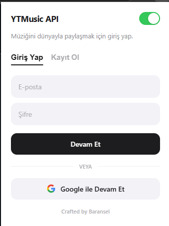
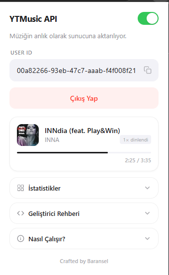
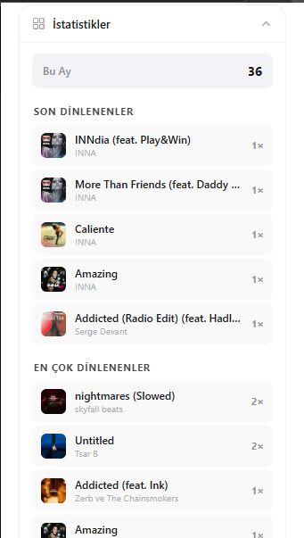
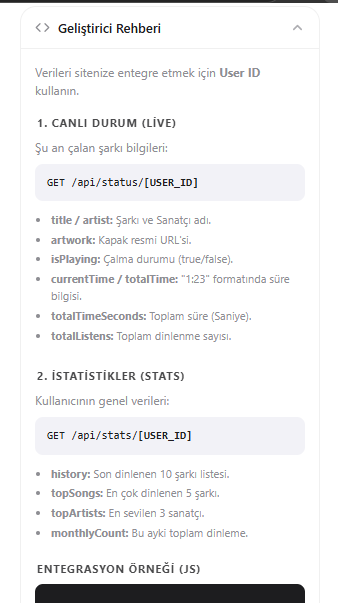
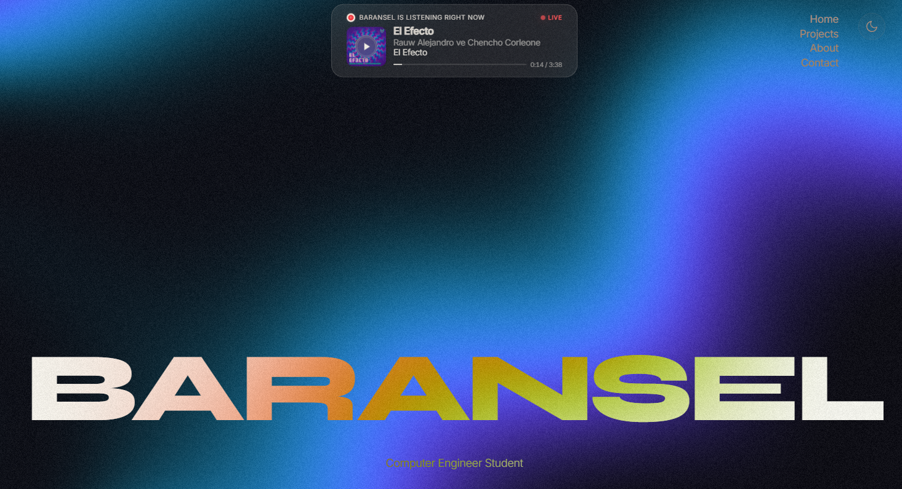

# YTMusic API

YouTube Music'te dinlediğiniz şarkıyı gerçek zamanlı olarak yakalayan ve bir API üzerinden dışarıya açan Chrome eklentisi. Kendi web sitenizde "şu an dinliyorum" widget'ı yapmak, dinleme istatistiklerini takip etmek veya Discord'da ne dinlediğinizi göstermek için kullanabilirsiniz.

---

## Nasıl Çalışıyor

Sistem üç parçadan oluşuyor:

1. **Chrome Eklentisi** — YouTube Music sekmesinden şarkı bilgilerini (ad, sanatçı, kapak, süre) her yarım saniyede bir okur ve backend'e gönderir.
2. **Backend API** — Gelen veriyi PostgreSQL veritabanına yazar, herkese açık endpoint'ler üzerinden sunar.
3. **Discord Bridge** (opsiyonel) — API'den aldığı veriyi Discord Rich Presence olarak yansıtır.

Eklenti tarafında veri toplama işi bir content script ile yapılıyor. YouTube Music'in player bar'ındaki DOM elementlerinden title, artist, artwork ve zaman bilgisi çekiliyor. Bu veri background service worker üzerinden backend'e POST ediliyor.

Backend tarafında Express.js çalışıyor. Kullanıcı kaydı ve girişi bcrypt + JWT ile yapılıyor. Her kullanıcıya benzersiz bir API Key (veri göndermek için) ve User ID (veri okumak için) atanıyor. Prisma ORM ile PostgreSQL'e bağlanıyor.

---

## Giriş ve Kayıt

Eklentiyi yükledikten sonra ilk iş bir hesap oluşturmak. E-posta ve şifre ile kayıt olabilirsiniz. Giriş yaptığınızda eklenti arka planda çalışmaya başlıyor.

Kimlik doğrulama Express tarafında rate limiting ile korunuyor. Şifreler bcrypt ile hashleniyor, düz metin olarak hiçbir yerde saklanmıyor.

<p align="center">
  
</p>

---

## Anlık Dinleme Durumu

Giriş yaptıktan sonra eklenti popup'ında o an çalan şarkıyı görüyorsunuz. Kapak resmi, sanatçı adı, ilerleme çubuğu ve toplam dinlenme sayısı burada gösteriliyor.

Bu veri aynı zamanda backend'deki `/api/status/:userId` endpoint'i üzerinden herkes tarafından okunabilir durumda. Eğer 15 saniye boyunca yeni veri gelmezse, sunucu otomatik olarak oynatma durumunu "durdu" olarak işaretliyor.

<p align="center">
  
</p>

---

## Dinleme İstatistikleri

Eklenti her şarkı değişiminde bir log kaydı tutuyor. Bu kayıtlar üzerinden son 30 günlük dinleme sayısı, son 7 günün en çok dinlenen şarkıları ve favori sanatçıları hesaplanıyor.

Sorgular Prisma üzerinden raw SQL ile yapılıyor. Zaman filtreleri sayesinde eski veriler istatistikleri kirletmiyor ve veritabanı performansı korunuyor.

<p align="center">
  
</p>

---

## Geliştirici Entegrasyonu

Kendi web sitenize "şu an ne dinliyorum" widget'ı eklemek istiyorsanız tek ihtiyacınız User ID'niz. API Key gizlidir ve sadece eklenti tarafında kullanılır. User ID ise herkese açıktır, kaynak kodunuzda bulunmasında sorun yoktur.

İki temel endpoint var:

```
GET /api/status/:userId    — Anlık çalan şarkı bilgisi
GET /api/stats/:userId     — Dinleme istatistikleri
```

Status endpoint'i şu yapıda bir JSON döndürüyor:

```json
{
  "title": "Starboy",
  "artist": "The Weeknd",
  "album": "Starboy",
  "artwork": "https://...",
  "currentTime": "1:45",
  "totalTime": "3:50",
  "currentTimeSeconds": 105,
  "totalTimeSeconds": 230,
  "isPlaying": true,
  "totalListens": 42
}
```

Stats endpoint'i ise son dinlenenleri, haftalık top şarkıları, favori sanatçıları ve aylık toplam dinleme sayısını içeriyor.

<p align="center">
  
</p>

---

## Sitenize Widget Ekleyin

Aşağıdaki örnek, basit bir fetch çağrısıyla sitenize canlı bir "şu an dinliyorum" kartı eklemenizi gösteriyor:

```javascript
const USER_ID = 'your-user-id';
const API = 'https://api.music.baransel.site/api';

async function getNowPlaying() {
  const res = await fetch(`${API}/status/${USER_ID}`);
  const data = await res.json();

  if (data.isPlaying) {
    console.log(`${data.title} - ${data.artist}`);
  }
}

getNowPlaying();
setInterval(getNowPlaying, 3000);
```

<p align="center">
  
</p>

---


## Teknolojiler

| Katman | Kullanılan |
|--------|-----------|
| Eklenti | Chrome Extension Manifest V3, Content Scripts |
| Backend | Node.js, Express.js, Prisma ORM |
| Veritabanı | PostgreSQL |
| Auth | bcrypt, JWT |
| Discord | discord-rpc |

---

## Lisans

MIT
